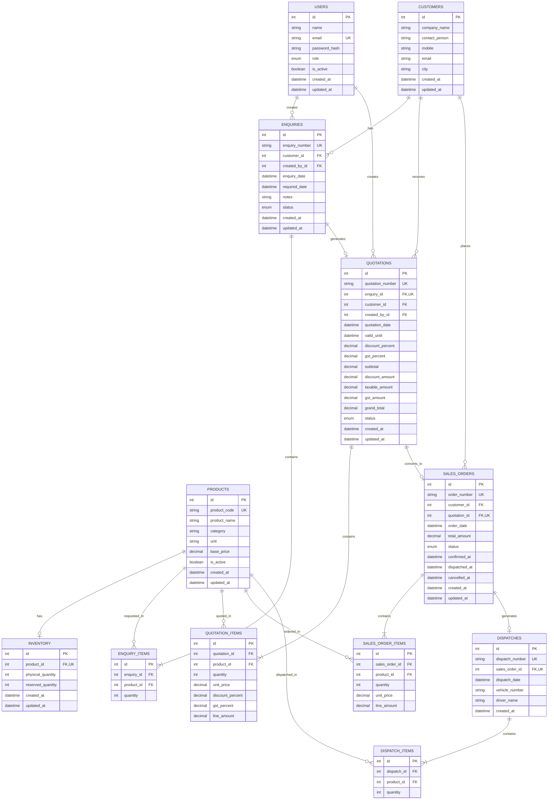

# SupplyFlow ERP — Entity Relationship Diagram

## Workflow Traceability

**Customer → Enquiry → Quotation → Sales Order → Inventory Reservation → Dispatch**

- `CUSTOMERS` stores customer master data.
- `ENQUIRIES` stores customer requirements and references `ENQUIRY_ITEMS`.
- `QUOTATIONS` belongs to one enquiry and references `QUOTATION_ITEMS`.
- An accepted quotation can generate at most one `SALES_ORDER`.
- `SALES_ORDERS` references `SALES_ORDER_ITEMS` and controls confirmation, reservation, cancellation, and dispatch.
- `INVENTORY` maintains physical and reserved quantities for each product.
- `DISPATCHES` belongs to one sales order and references `DISPATCH_ITEMS`.
- Product references are maintained through foreign keys across all transaction item tables.

## Key Database Constraints

- User email is unique.
- Product code is unique.
- Enquiry number is unique.
- One quotation per enquiry.
- One sales order per quotation.
- One dispatch per sales order.
- One inventory record per product.
- Duplicate product lines are prevented within each transaction using composite unique constraints.
- Foreign keys enforce relationships between master and transaction records.
